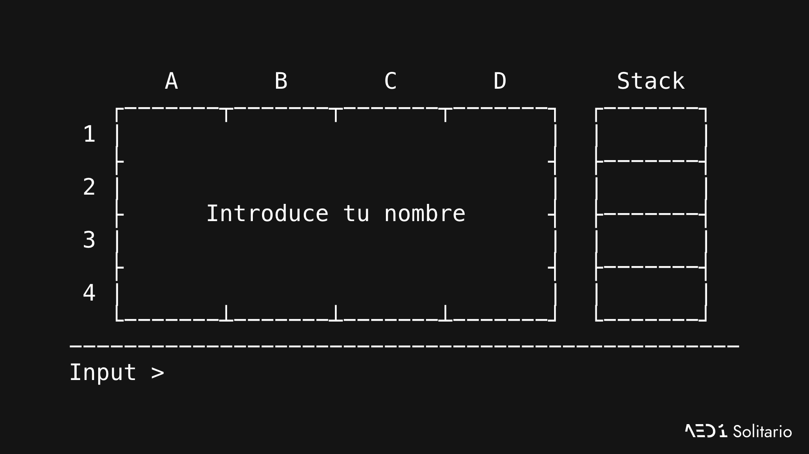
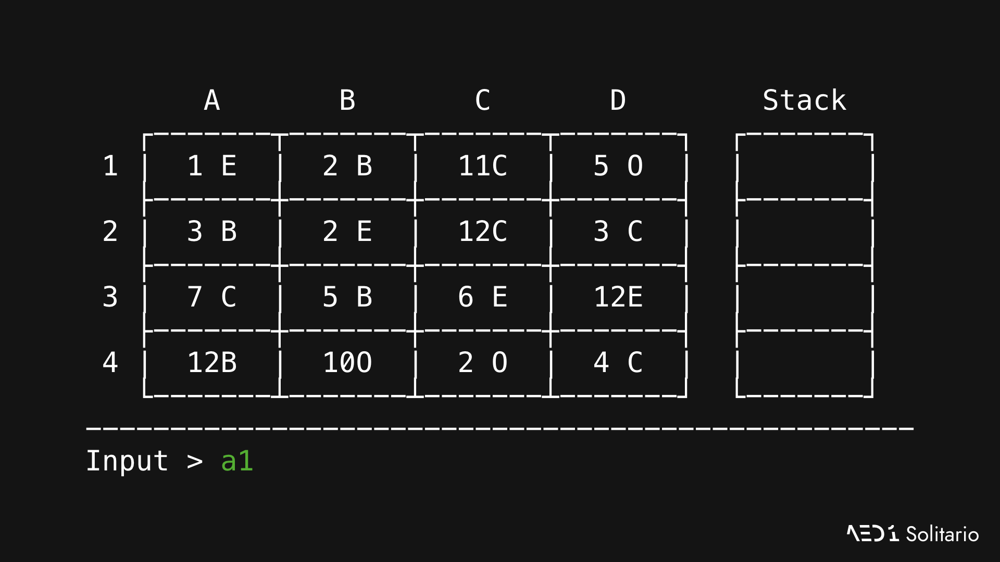
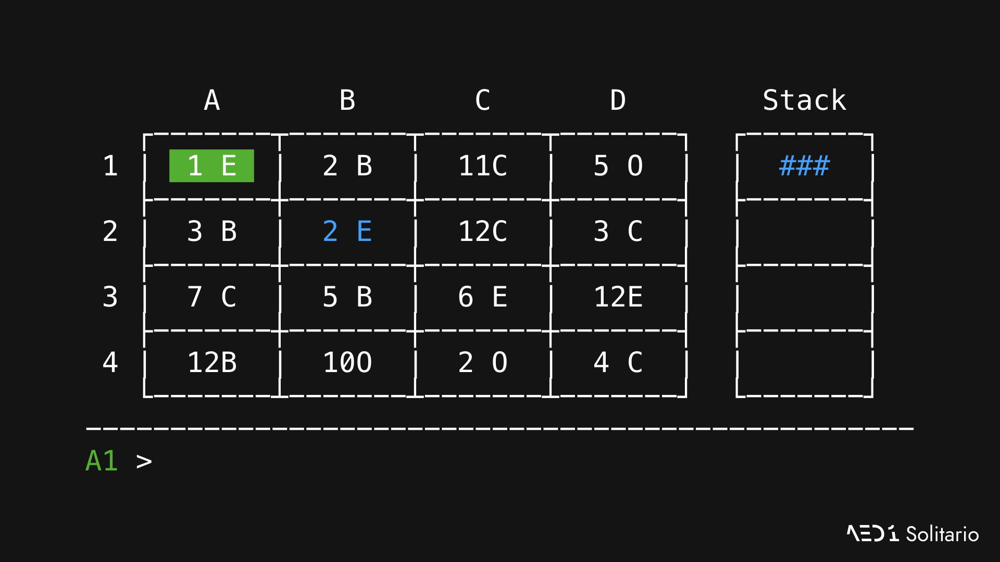
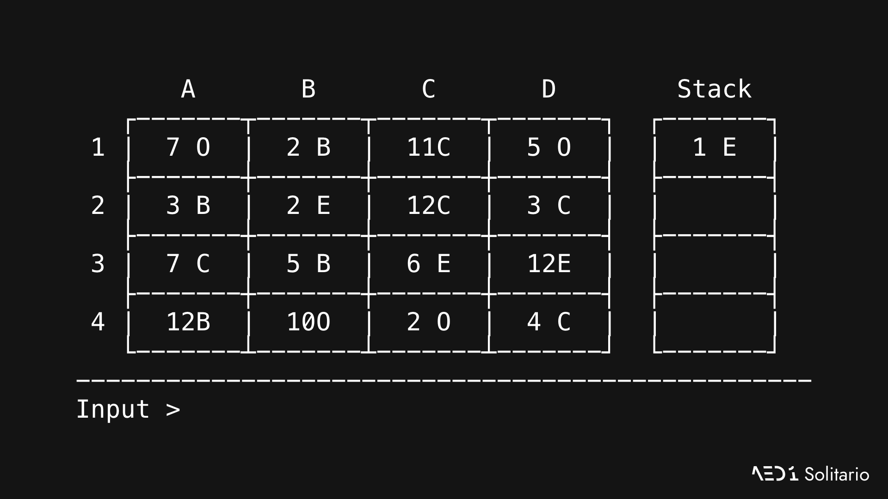
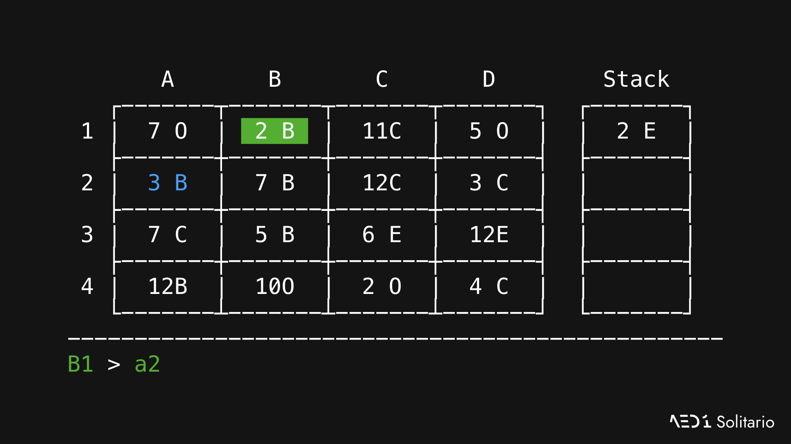
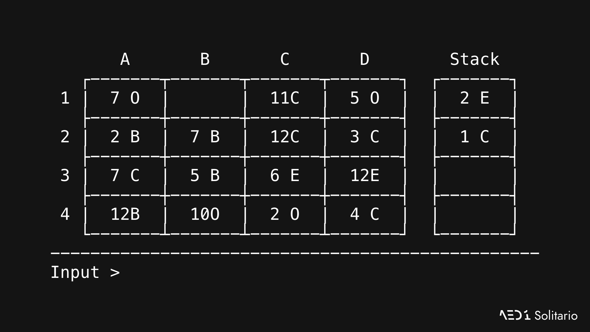

# Cómo jugar

## La UI _\(Interfaz de usuario\)_

#### Inicio del juego

Introduce tu nombre en la barra de `Input`. Después, se generarán de manera aleatoria las pilas para cada **celda** de nuestra **mesa**.

La mesa se compone de un total de 20 celdas, repartidas en una **zona interior** \(16 celdas: _**`A1`**_ a _**`D4`**_\) y una **zona exterior** \(4 celdas: _**`Stack 1`**_ a _**`Stack 4`**_\).

En cada celda se muestra la carta en el tope de la pila. Si no se muestra nada en esa celda, es que no hay ninguna carta en esa pila. Por ejemplo, por defecto, las celdas de la **zona exterior** están vacías.

#### Una carta

Cada carta se representa por:

* **1 o 2 dígitos**: del _`1`_ \(As\) al _`7`_ y del _`10`_ \(Sota\) al _`12`_ \(Rey\).
* **1 carácter**: _`B`_ \(Bastos\), _`C`_ \(Copas\), _`E`_ \(Espadas\) u _`O`_ \(Oros\).

De esta forma, la carta en la celda _**`C2`**_  \(_`12C`_\) representa el 12 \(Rey\) de Copas y la carta en _**`B3`**_  \(_`5B`_\) representa el 5 de Bastos.

#### Ejemplo de juego y selección de celdas

Pongamos el ejemplo de que queremos seleccionar la celda _**`A1`**_ para ver qué podemos hacer con esa carta.


Solo puedes seleccionar celdas de la **zona interior**.


Hemos escrito la celda que queremos ver.


Para seleccionar una celda, puedes escribir primero la fila y después la columna o viceversa. Incluso en minúsculas.


En este caso, al seleccionar esta celda y pulsar `↩ (Enter)`, automáticamente aparecen las opciones de interacción con esa carta:

Vemos como en la línea de entrada el mensaje ya no es `Input`, sino nuestra celda \(_**`A1`**_\).

En la celda elegida,  aparece en un fondo verde, indicando qué carta hemos seleccionado.

Como es el _`1 E`_ \(As de Espadas\), se muestra en **azul** la pila _**`B2`**_, porque es del mismo palo y de un valor superior por una unidad: _`2 E`_ \(2 de Espadas\).

Como, además, es un _`1`_ \(As\), la primera celda de la **zona exterior** disponible se marca en azul también, en este caso _**`Stack 1`**_.

Ahora podemos mover nuestra carta a cualquiera de esas 2 pilas. Como es un As, en este ejemplo, aprovecharemos para moverla a _**`Stack 1`**_, para ello, escribimos `STACK` en la línea de entrada.


Al igual que con las celdas, todos los comandos también pueden ser escritos, total o parcialmente, en minúsculas.


Ahora, una vez despalazada la primera carta de la pila _**`A1`**_, la siguiente carta de esta pila \(que se encontraba oculta debajo del _`1 E`_ \(As de Espadas\)\) se muestra en esta celda. En este caso, el `7 O` \(7 de Oros\).

Ahora podemos mover la carta en el tope de la pila de la celda _**`B2`**_ \(_`2 E`_ \(2 de Espadas\)\) al _**`Stack 1`**_, ya que es la carta siguiente de ese palo \(Espadas\).

Así, continuamos jugando, colocando los ases en las pilas de la **zona exterior** y, sobre ellos, las cartas del mismo palo de un valor superior por 1 unidad.


Recuerda que después del _`7`_ viene el _`10`_ \(Sota\).


Veamos ahora un caso en el que:

* No tenemos ningún As para colocar en los _**`Stack`**_.
* Y las cartas siguientes a las que ya están en los _**`Stack`**_ \(_`2 E`_\) no están disponibles \(no hay ningún _`3 E`_ visible\)

En este caso, solo podemos mover cartas en la **zona interior**, apilándolas sobre otras, para ver que había debajo.

Vemos como podemos colocar el _`2 B`_ \(2 de Bastos\) \(de la celda _**`B1`**_\) sobre el _`3 B`_ \(3 de Bastos\) \(de la celda _**`A2`**_\).

Para hacer esto:

* Seleccionamos primero la celda donde está la carta que queremos mover \[_**`B1`**_\].
* E introducimos a dónde la queremos mover \[_**`A2`**_\].

Así, veremos cuál es la primera carta que quedaba debajo en la celda _**`B1`**_.


Si deseas cancelar la selección de una carta para volver a la vista en reposo, simplemente escribe `CANCEL`.


En este ejemplo había un _`1 C`_ \(As de Copas\) debajo, así que lo hemos seleccionado y movido al primer _**`Stack`**_ disponible \(en este caso, como solo el primero estaba ocupado, se ha movido a _**`Stack 2`**_\). Dejamos así visible la carta que estaba debajo de esta en la celda _**`B1`**_, pero como no había ninguna, simplemente se muestra vacía:

#### Fin del juego

Habremos alcanzado el final cuando en la **zona interior** no queden cartas y se encuentren todas en los _**`Stack`**_ de la **zona exterior**. Eso significará que habremos ganado.

También podemos alcanzar un final habiendo perdido, si en la **zona interior** aún quedan cartas pero no hay ningún movimiento posible.

En cualquiera de estos 2 casos, de manera automática el juego detectará que habrás alcanzado el final, y se mostrará en la línea de entrada la palabra _`End`_.

### Lista de comandos

<table>
  <thead>
    <tr>
      <th style="text-align:center">Comando</th>
      <th style="text-align:left">Descripci&#xF3;n</th>
      <th style="text-align:left">Necesario</th>
    </tr>
  </thead>
  <tbody>
    <tr>
      <td style="text-align:center"><code>A1</code> a <code>D4</code> / <code>1A</code> a <code>4D</code>
      </td>
      <td style="text-align:left">
        
Selecciona una celda de la zona interior.

        <ul>
          <li>Si est&#xE1; en reposo: selecciona una carta.</li>
          <li>Si hay una carta seleccionada: la mueve al destino introducido.</li>
        </ul>
      </td>
      <td style="text-align:left">Que el juego no finalizase a&#xFA;n.</td>
    </tr>
    <tr>
      <td style="text-align:center"><code>STACK</code>
      </td>
      <td style="text-align:left">Coloca una carta en la pila de la zona exterior correspondiente.
         Si es un As, se colocar&#xE1; en la primera disponible.</td>
      <td style="text-align:left">
        <ul>
          <li>Que el juego no finalizase a&#xFA;n.</li>
          <li>Que una carta est&#xE9; seleccionada.</li>
        </ul>
      </td>
    </tr>
    <tr>
      <td style="text-align:center"><code>CANCEL</code>
      </td>
      <td style="text-align:left">Anula la selecci&#xF3;n de una carta o vuelve a la pantalla anterior si
        se est&#xE1; mostrando la pantalla de informaci&#xF3;n.</td>
      <td style="text-align:left">&#x2014;</td>
    </tr>
    <tr>
      <td style="text-align:center"><code>END</code>
      </td>
      <td style="text-align:left">Termina el programa.</td>
      <td style="text-align:left">&#x2014;</td>
    </tr>
    <tr>
      <td style="text-align:center"><code>RESTART</code>
      </td>
      <td style="text-align:left">Reinicia el juego desde cero.</td>
      <td style="text-align:left">&#x2014;</td>
    </tr>
    <tr>
      <td style="text-align:center"><code>INFO</code>
      </td>
      <td style="text-align:left">Muestra el link a esta documentaci&#xF3;n.</td>
      <td style="text-align:left">&#x2014;</td>
    </tr>
  </tbody>
</table>
Todos los comandos pueden ser escritos en mayúsculas o minúsculas, total o parcialmente.


